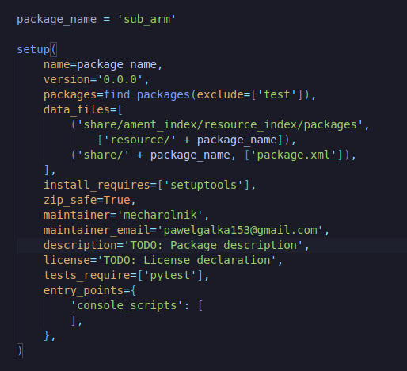
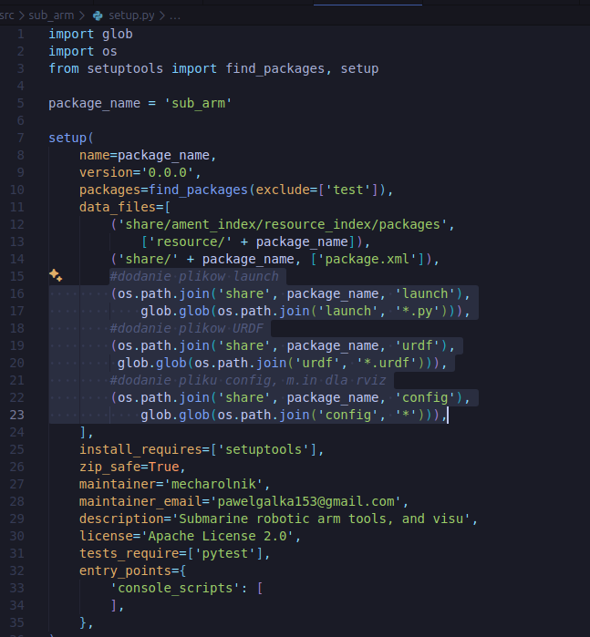

# Launch file - WIP !!

za pomoca launch file wystartujemy robot_state_publisher, joint_state_publisher oraz rviz2  

1. robot_state_publisher - czyta URDF i publikuje pozycje przegubow
2. joint_state_publisher_gui - daje GUI do sterowania przegubami
3. rviz2 - pokazuje robota w 3d

przechodzimy do src/sub_arm/launch  

towrzymy  
    touch display.launch.py

i w srodku:
```python
import os
from launch import LaunchDescription
from launch_ros.actions import Node
from launch.substitutions import Command
from ament_index_python.packages import get_package_share_directory


def generate_launch_description():
    # Ścieżka do katalogu pakietu
    pkg_share = get_package_share_directory('sub_arm')
    urdf_file = os.path.join(pkg_share, 'urdf', 'sub_arm.urdf')
    
    # Wczytaj plik URDF
    with open(urdf_file, 'r') as infp:
        robot_desc = infp.read()

    # Node 1: robot_state_publisher
    # Publikuje transformacje (tf) robota na podstawie URDF
    robot_state_publisher_node = Node(
        package='robot_state_publisher',
        executable='robot_state_publisher',
        name='robot_state_publisher',
        output='screen',
        parameters=[{
            'robot_description': robot_desc,
            'use_sim_time': False,
        }],
    )

    # Node 2: joint_state_publisher_gui
    # Graficzny interfejs do sterowania przegubami
    joint_state_publisher_gui_node = Node(
        package='joint_state_publisher_gui',
        executable='joint_state_publisher_gui',
        name='joint_state_publisher_gui',
        output='screen',
    )

    # Node 3: RViz2
    # Wizualizacja robota
    rviz_node = Node(
        package='rviz2',
        executable='rviz2',
        name='rviz2',
        output='screen',
        arguments=['-d', os.path.join(pkg_share, 'config', 'display.rviz')],
    )

    return LaunchDescription([
        robot_state_publisher_node,
        joint_state_publisher_gui_node,
        rviz_node,
    ])
```

### teraz trzeba zmodyfikowac setup.py w src/sub_arm/

aby ROS znalazl stworzone przez ans pliki t.j. URDF, launch i inne jakie sie w przyszlosci stworzy, zmieniamy setup.py

> pierwotne setup.py:  


> w sekcji data_files, dodajemy info gdzie moze znalezc nasze pliki



## teraz mozna zbudowac paczke

!tu moga byc problemy - WIP

```bash
cd ~/ros2_ws
colcon build --packages-select sub_arm
source install/setup.bash
ros2 launch sub_arm display.launch.py
```
