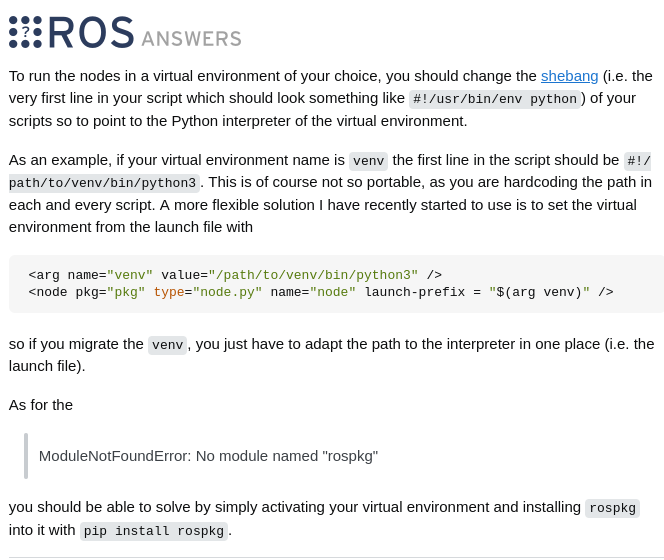

# Python virtual env
Podczas proby instalacji bibliotek pythona, pewnie czesto widac komunikat:

```
error: externally-managed-environment

× This environment is externally managed
╰─> To install Python packages system-wide, try apt install
    python3-xyz, where xyz is the package you are trying to
    install.
    
    If you wish to install a non-Debian-packaged Python package,
    create a virtual environment using python3 -m venv path/to/venv.
    Then use path/to/venv/bin/python and path/to/venv/bin/pip. Make
    sure you have python3-full installed.
    
    If you wish to install a non-Debian packaged Python application,
    it may be easiest to use pipx install xyz, which will manage a
    virtual environment for you. Make sure you have pipx installed.
    
    See /usr/share/doc/python3.12/README.venv for more information.

note: If you believe this is a mistake, please contact your Python installation or OS distribution provider. You can override this, at the risk of breaking your Python installation or OS, by passing --break-system-packages.
hint: See PEP 668 for the detailed specification.
```

dzieje sie tak, bo pewnie probojesz zainstalwoac biblioteke system-wide i sie python o to sra bo moga byc konflitky czy cos, rozwiazaniem na to jest stworzenie wirtualnego srodowiska, biblioteki beda instalowane tylko tam by nic sie nie gryzlo w innych srodowiskach

> ewentualnie mozna sprobowac pobrac ta paczke przez:
    apt install
    python3-xyz  
      
    ale nie zawszze to dziala, nie ma paczki w apt


## tworzenie venv
wchodzimy do ros2_ws, nstp  
  
    python -m venv venv


## venv a ros - WIP

nie jestem pewien czy na pewno to dobry i czysty solution 
cofnalem sie poza ros2_ws (workspace) i stworzylem w nim venv za pomoca polecenia:  

~~python3 -m venv ros2_ws --system-site-packages~~  

    python3 -m venv venv --system-site-packages  

* Flaga --system-site-packages pozwala venv widzieć pakiety ROS 2 (np. rclpy).

pojawily sie katalogi:
```
  Include
  Lib
  Scripts
  .gitignore
  pyvenv.cfg 
```

teraz by aktywowac venv  
wchodzimy do ros2_ws  


i aktywujemy
source venv/bin/activate  

teraz juz mozna instalowac paczki do venv  
     ~~sudo~~ pip3 install pyside6  


### mozliwe problemy

podczas instalacji z pomoca pip znowu moze sie pojawic komunikat ze chcemy instalowac system-wide, wtedy prawodpodobnie mamy doczynienia z zlymi uprawnieniami do katalogu z venv, mozna to sprawdzic:  

    ls -ld ~/ros2_ws/venv  
    ls -l ~/ros2_ws/venv/lib/python3.12/site-packages  

u mnie:
```bash
(ros2_ws) mecharolnik@lenovo:~/ros2_ws$ ls -ld ~/ros2_ws
drwxrwxr-x 11 mecharolnik mecharolnik 4096 Oct 20 23:46 /home/mecharolnik/ros2_ws
(ros2_ws) mecharolnik@lenovo:~/ros2_ws$ ls -l ~/ros2_ws/lib/python3.12/site-pac
kages
total 8
drwxr-xr-x 5 root root 4096 Oct 20 23:46 pip
drwxr-xr-x 2 root root 4096 Oct 20 23:46 pip-24.0.dist-info
```
> widac ze uprawnienia do katalogow ma root, nie moj user czyli 'mecharolnik'

wtedy nalezy nadac sobie uprawnienia:  
```
sudo chown -R mecharolnik:mecharolnik ~/ros2_ws/venv
```

Oznaczamy venv jako ignorowany przez colcon:  
```
touch ~/ros2_ws/venv/COLCON_IGNORE
```

potem mozemy juz smialo 
    colcon build --packages-select sub_arm
---
WIP

