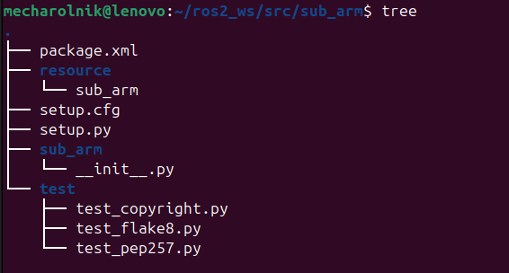
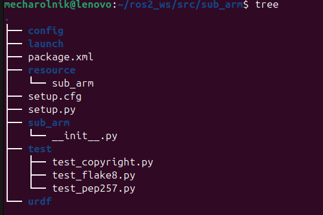

# notatki te sa "robocze" i mogą wprowadzać w błąd .. tutoriali nigdy nie pisalem

> (moga  tez zawierac mieszany polski i angielski :P),

---

## Tworzenie package

    ros2 pkg create [nazwa_paczki] [build-type] [dependencies]

> **[build-type]**  e.g.  
> --build-type ament_python  
> --build-type ament_cmake  
> a dla cpp i py:  
> --build-type ament_cmake_python

> **[dependencies]** e.g.
> --dependencies rclpy std_msgs geometry_msgs sensor_msgs

### na przykładzie paczki sub_arm

przechodzimy do workspace i nstp **src**

    cd $HOME/ros2_ws/src

tworzymy paczke:

    ros2 pkg create sub_arm --build-type ament_python --dependencies rclpy std_msgs geometry_msgs sensor_msgs

po wykonaniu dla py, ukaze sie struktura:

    sub_arm/
    ├── sub_arm/           # Drugi sub_arm/ to folder na moduły Python (konwencja ROS 2, tam trafia kod)
    ├── resource/
    ├── test/
    ├── package.xml        # manifest - opisuje pakiet
    ├── setup.py           # konfiguracja Pythona
    └── setup.cfg

## Sprawdzenie package.xml w ktorym sa rozpisane dependencies

TODO: rozpisac [depend], [test_depend], [exec_depend] and more

na razie mysle safe uzywac [depend], w teorii z pythonem powinno sie uzywac [exec_depend]?

w pliku mozemy zauwazyc zaleznosci:

* robot_state_publisher - wysyla info o pozycji robota np do rviz

* urdf - biblioteka do parsowania opisu robota

## utworzenie pozostalych katalogów:

katalog pod plik launch, uruchamiajacy wszystkie potrzebne nodes na raz
>z poziomu ros2_ws/src wywolujemy:

    mkdir -p sub_arm/launch

katalog pod urdf - opisy robota w xml

    mkdir -p sub_arm/urdf

katalog config - konfiguracja np ilosc przegubow, dlugosci czy cos tam, jakies params

    mkdir -p sub_arm/config

## instalacja dodatkowych pakietow

graficzny interfejs do zarzadzania przegubami:

    sudo apt install ros-jazzy-joint-state-publisher-gui

wezel?biblioteka? publikujacy stan robota:

    sudo apt install ros-jazzy-robot-state-publisher

rviz - ROS Visualization:

    sudo apt install ros-jazzy-rviz2

## teraz mamy paczke stworzona, nic jeszcze nie zadziala xd, trzeba cos popisac i utworzyc executable z tego budujac rzeczy z src - i think

przejdzmy dalej np do tworzenia urdf
