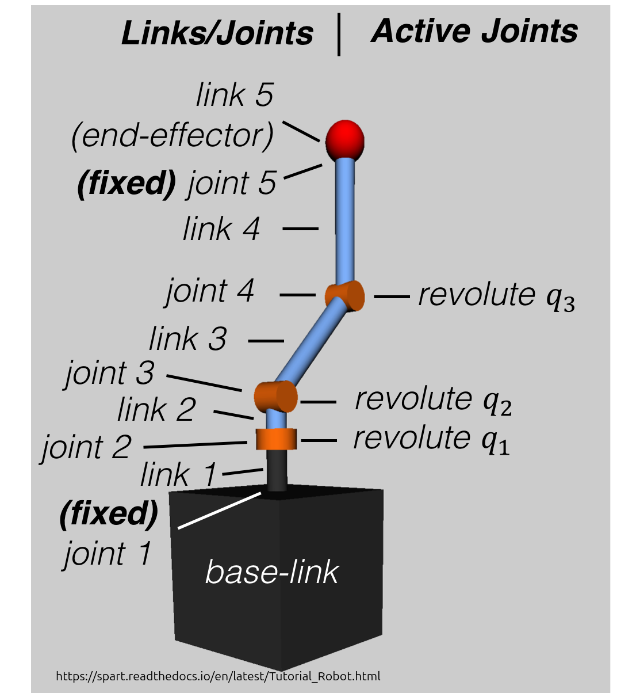

# URDF - Unified Robot Description Format - WIP !

## O URDF

plik .xml, opsiuje konstrukcje fizyczna robota, generalnie model 3D, informacje o przegubach, motorach?, masie elementów etc.

Dane z urdf sa uzywane w symulacjach, wizualizacjach

podobno do dobrego zrozumienia urdf trzeba ogarnac wczesniej tf2 - "transform"
[link do doku tf2](https://wiki.ros.org/tf2)  
ale j*bac to na razie

### podstawowe elementy URDF

#### links (ogniwa)

- czesci robota (powiedzmy takie prostopadłościany między "stawami")  
kazde ogniwo ma wiadomo mase, wymiary, geometrie

#### Joints (przeguby - "stawy")

- polaczenia miedzy ogniwami

##### rozrozniamy typy

**revolute** - przegub obrotowy u nas bedzie 6, 6stopni swobody z samego ramienia + 1def bedzie z chwytaka ale nie wiem jak tam on jest zbudowany

**fixed** - sztywne polaczenie np zamocowany gdzies do ramienia sensor

> kazdy joint ma minimalny/maksymalny kat obrotu (z,y,x), limit sily

### Transformacje

-opisuja gdzie jest kazde ogniwo wzgledem drugiego

> (ja rozumiem jako posów)

## przykład



```
base_link (podstawa - nieruchoma)
    ↓ (joint1 - fixed)
link1 (przegub 1)
    ↓ (joint2 - obrót)
link2 (przegub 2)
    ... i tak dalej ...
    ↓ (joint4 - obrót)
link4 (przegub)
    ↓ (joint5 - fixed)
link5 gripper_link (chwytak)
```

## tworzenie urdf

w katalogu
    src/sub_arm/urdf/

tworzymy plik urdf:
    touch sub_arm.urdf

### a w pliku zaczynamy od stworzenia robota:

```xml
<?xml version="1.0" ?>
<robot name="sub_arm">
<!--...-->
</robot>
```

nastepnie tworzymy w srodku pierwszy link - podstawe robota

```xml
<link name="base_link">
        <inertial>
            <mass value="">
            <origin zyx="" rpy="">
            <inertia ixx="" ixy ixz iyx iyy .. izz>
        </inertial>
        <visual>
            <origin zyx="" rpy="">
            <geometry>
                np. <cylinder radius="" length="">
            </geometry>
            <material>
                <color rgba"...">
            </material>
        </visual>
        <collision>
            <origin zyx="" rpy="">
            <geometry>
                to samo zazw. co wyzej. <cylinder ..>
            </geometry>
        </collision>
</link>

```

gdzie 
[inertial] - paramtery fizyczne (masa, inercja) 
>wartosci do tego rozumiem mamy sobie randomowe dobrac

[visual] - ofc  
|-> [origin] gdzie wzgledem linku? jest rysowany  
|-> [geometry] -ksztalt  

[collision] -geometria do detekcji kolizji -zazwyczaj to samo co w visual  

potem mozemy dodac joint zeby potem polaczyc nstp link itd itd  

joint:
```xml
  <joint name="joint1" type="revolute">
    <parent link="link2"/>
    <child link="link3"/>
    <origin xyz="0 0 0.3" rpy="0 0 0"/>
    <axis xyz="0 1 0"/>
    <limit lower="-1.57" upper="1.57" effort="100" velocity="1.0"/>
  </joint>
```
gdzie
[parent] i [child] to wiadomo ktore linki laczy  
[origin] gdzie jest ten przegub relatywnie do parent link  
[axis] wybieramy os obrotu np wybieramy os y to   
```xml
<axis xyz="0 1 0">
```
[limit] min/max kat, obciazenie, predkosc


### to potem zostanie rozszerzone
TODO: roszerzyc xd


## WAZNE: by rviz zadzialal z tym naszym urdf
musimy sobie dodac nawet pusty plik konfiguracyjny .rviz do src/sub_arm/config/

    touch display.rviz

wystarczy pusty na razie

## Na razie mozna przejsc do notatek odn. ustawiania launchfile


